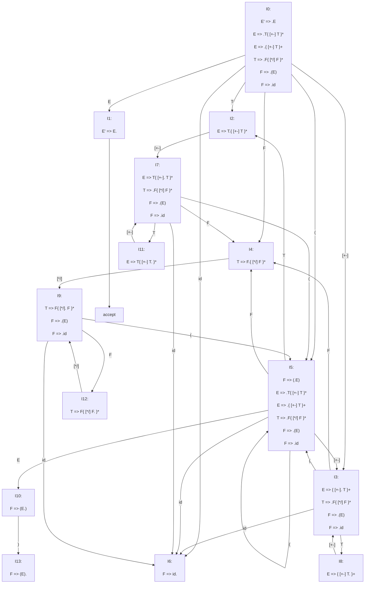

<h1 align="center">Визуализация синтаксического анализа</h1>
<h3 align="center">Домашнее задание №0 курса "Введение в тензорные компиляторы"</h3>

## Описание программы

Программа реализует синтаксический анализ shift/reduce простого "арифметического" языка с визуализацией всего процесса, т.е. значений в стеке, входного буффера и совершенного действия (перенос или свертка).

## Руководство пользователя

### Запуск программы

Чтобы собрать программу используйте Makefile (строка make в командной строке).

```
make
```

Создастся исполнительный файл analysis, который можно запустить.

```
./analysis
```

Далее необходимо ввести строку на языке анализатора.
Например, '''1 + 2 + 3 + x * y + (-2 + 5*(6+5) +3)'''

Арифметический язык состоит из сложения, вычитания, умножения, деления и скобок. Операции могут производиться над переменными или же над числами. Для простоты в качестве переменных могут быть только x, y и z.

### Ответ программы

Программа выведет процесс анализа в виде таблицы. В первом столбце выводится стек детерминированного конечного автомата, во втором - стек символов, в третьем - вход программы на данном этапе, в четвертом - действие, производимое на данном шаге.

В последней строке можно увидеть конечный итог, если анализ прошел успешно, то в четвертом столбце будет выведено "accept", если же мы наткнулись на синтаксическую ошибку, то увидим там "error".

### Тесты

Для запуска тестовых примеров, необходимо сделать следующее:

1. Создать исполняемый файл с тестирующей функцией
```
make test
```

2. Дальше есть несколько вариантов:

а) Запустить ./test, тогда программа запустит анализ на 24 тестовых файлах из папки tests и результат будет выведен на консоль.
```
./test
```
Можно перенаправить вывод в файл:
```
./test > res
```

б) Запустить ./test с параметрами. Параметры - целые числа от 1 до 24 (можно создать свои тесты и сохранить их в папке tests с названием test*, где вместо * любой набор символов (допустимых для названия файла), и запустить ./test * - соответственно, набор символов, идущий после test)
Тогда запустятся только конкретные файлы. Также можно перенаправить вывод.

в) Запустить make test_all
```
make test_all
```
Программа проанализирует 24 тестовых файла и запишет результат в файлы вида resn, где n - номер теста.
Можно посмотреть на результат напрямую в файле, но рекомендую выводить на консоль при помощи утилиты cat.

## Грамматика

Для упрощения под id подразумевается число (N), либо одна из переменных x, y, z;

Грамматика:
E' => E
E  => T{ [+-] T }\* | { [+-] T }+
T  => F{ [\*/] F }\*
F  => (E) | id 

[+-] - один из знаков "+" или "-" ([\*/] - аналогично)
{}\*  - 0 или более раз
{}+  - 1 или более раз

ДКА:



## Реализация

При написании программы были реализованы следующие структуры данных:
Синтаксический анализатор (syntax_analizer_t)
Стек (stack_t)
Список (итератор) (list_t)
Узел (используется списком и итератором) (node_t)

Лексический анализ проводится при использовании утилиты flex (lexer.l)

Синтаксический анализ реализован следующим образом:
Структура syntax_analizer_t содержит стек для детерминированного конечного автомата, стек для символов, список токенов.
При инициализации проводится лексический анализ и все токены записываются в список и ставится указатель на начало списка.
Анализ проводится внутри функции syntax_analysis, в которой запущен цикл, который завершается при ошибке или завершении анализа; внутри цикла конструкция switch case, которая определяет позицию в ДКА, на которой находится программа и запускает соответствующую функцию (I0 - I13)
В каждой из функций типа I* находится switch case конструкция, которая определяет следующий токен, и если возможно выполняет shift либо reduce, иначе завершает программу, вернув 1 и завершив цикл в функции syntax_analysis.